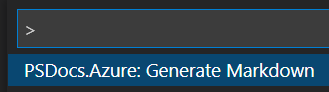
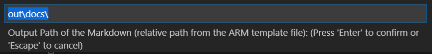
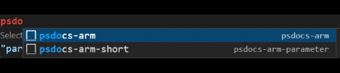

# PSDocs.Azure

[](https://dev.azure.com/viperdan/PSDocs-vscode/_build/latest?definitionId=50&branchName=main)


Generate documentation from Infrastructure as Code (IaC).  PSDocs for Azure automatically generates documentation for Azure infrastructure as code (IaC) artifacts.

Please review the [Requirements](#requirements) to ensure you can use this extension successfully.

Note: this extension is in preview. 

## Features

### Command Palette
You can generate markdown files directly from an ARM template through the Command Pallette.  Simply press `Ctrl+Shift+P` (Win/Linux) or `Command+Shift+P` (MacOS) and type in `PSDocs.Azure: Generate Markdown`



You will first be asked to provide a full path to the ARM template.  The prompt auto-populates with the full path of the currently opened file.


Additionally, you will be asked to provide a relative path (from the ARM template) to store the generated markdown.



The markdown will be created in the folder relative to the the ARM template file.

### Snippets

Adds snippets for adding metadata tag within ARM templates. 
* `psdocs-arm` can be used to add metadata at the template root schema
* `psdocs-arm-short` can be used to add metadata anywhere else e.g. parameters or variables




## Requirements

PSDocs.Azure is required for this extension to work. 

To install the module use the following command from a PowerShell prompt.

```powershell
Install-Module -Name PSDocs.Azure -Scope CurrentUser;
```

## Known Issues and Limitations

* The extension is in preview and therefore has not undergone extended testing scenarios. 
* Only one markdown can be generated at one time. 
* A separate directory should be used to avoid overriding the Generated Markdown --> README.md file. 
* Additional PSDocs.Azure [configuration](https://github.com/Azure/PSDocs.Azure/blob/main/docs/concepts/en-US/about_PSDocs_Azure_Configuration.md) is not supported at this time. 

## Release Notes

Refer to [CHANGELOG](CHANGELOG.md)

## Contributing

This project welcomes contributions and suggestions.
If you are ready to contribute, please visit the [contribution guide].

## Code of Conduct

This project has adopted the [Microsoft Open Source Code of Conduct](https://opensource.microsoft.com/codeofconduct/).
For more information see the [Code of Conduct FAQ](https://opensource.microsoft.com/codeofconduct/faq/)
or contact [opencode@microsoft.com](mailto:opencode@microsoft.com) with any additional questions or comments.

## Maintainers

- [Vic Perdana](https://github.com/VicPerdana)
- [Bernie White](https://github.com/BernieWhite)

## License

This project is [licensed under the MIT License][license].

[issue]: https://github.com/Microsoft/PSDocs-vscode/issues
[discussion]: https://github.com/microsoft/PSDocs-vscode/discussions
[ci-badge]: https://dev.azure.com/viperdan/PSDocs-vscode/_apis/build/status/PSDocs-vscode-CI?branchName=main
[vscode-ext-gallery]: https://code.visualstudio.com/docs/editor/extension-gallery
[ext-preview]: https://marketplace.visualstudio.com/items?itemName=viperdan.PSDocs-vscode-preview
[ext-preview-version-badge]: https://vsmarketplacebadge.apphb.com/version/viperdan.PSDocs-vscode-preview.svg
[ext-preview-installs-badge]: https://vsmarketplacebadge.apphb.com/installs-short/viperdan.PSDocs-vscode-preview.svg
[ext-stable]: https://marketplace.visualstudio.com/items?itemName=viperdan.PSDocs-vscode
[ext-stable-version-badge]: https://vsmarketplacebadge.apphb.com/version/viperdan.PSDocs-vscode.svg
[ext-stable-installs-badge]: https://vsmarketplacebadge.apphb.com/installs-short/viperdan.PSDocs-vscode.svg
[module-version-badge]: https://img.shields.io/powershellgallery/v/PSDocs.svg?label=PowerShell%20Gallery&color=brightgreen
[contribution guide]: https://github.com/Microsoft/PSDocs-vscode/blob/main/CONTRIBUTING.md
[change log]: https://github.com/Microsoft/PSDocs-vscode/blob/main/CHANGELOG.md
[license]: https://github.com/Microsoft/PSDocs-vscode/blob/main/LICENSE
[ps-rule.yaml]: https://microsoft.github.io/PSDocs/concepts/PSDocs/en-US/about_PSDocs_Options.html


